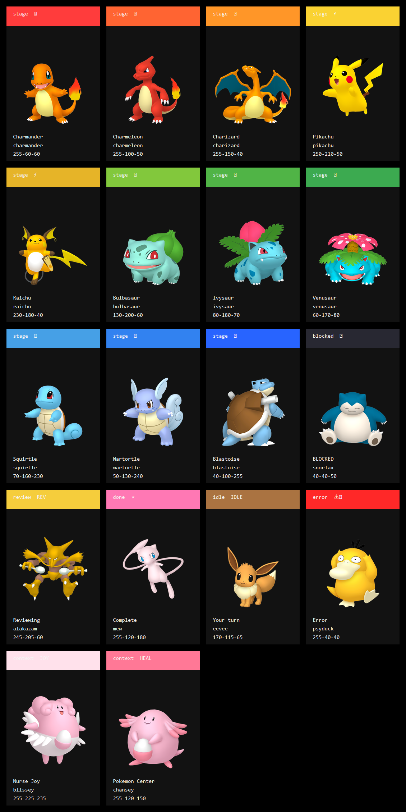

# VisualHUD

A themeable visual status engine for Claude Code, Codex, and iTerm2.

Current release candidate: `1.2.0`. It is available from the source repository;
the npm registry remains on the previous public version until the supervised
publication gate is complete.

Watch your terminal transform in real-time as your agent works — colors shift, backgrounds swap, and tab titles update to show exactly where things stand. Ship with themes or build your own.

## Install

VisualHUD installs into a single Git repo (never a global hook). Codex supports
macOS/iTerm2, Windows Terminal/PowerShell, and WezTerm. Claude Code support is
currently macOS/iTerm2.

**Claude Code:**

```bash
cd /path/to/repo
npx -y visualhud@latest install claude --target .
claude
```

That writes `.claude/hooks/visualhud-claude.sh`, merges VisualHUD entries into
`.claude/settings.json` (existing SDLC/TDD hooks are preserved), and lays down a
`.visualhud/` runtime with engine, themes, and the CLI.

**Codex:**

```bash
cd /path/to/repo
npx -y visualhud@latest
codex --yolo
```

The bare `npx -y visualhud@latest` invocation is shorthand for
`visualhud install codex --target .` — it writes `.codex/`, `.visualhud/`, and
`.agents/skills/visualhud-*` in the current repo.

To update an existing Codex install from npm, preserve its active theme and
renderer when invoking the newer installer.

**Bash update:**

```bash
active_theme="$(./.visualhud/visualhud theme current)"
renderer="$(sed -n 's/.*VISUALHUD_RENDERER="\([^\"]*\)".*/\1/p' .codex/hooks/visualhud-codex.sh | head -1)"
case "$renderer" in
  wezterm) platform=wezterm ;;
  windows) platform=windows ;;
  *) platform=macos ;;
esac
npx -y visualhud@latest install codex --target . --theme "$active_theme" --platform "$platform"
if [ "$platform" = wezterm ]; then
  pwsh -ExecutionPolicy Bypass -File ./.visualhud/setup-wezterm.ps1
fi
```

**PowerShell update:**

```powershell
$activeTheme = (Get-Content .visualhud/theme -Raw).Trim()
$wrapper = Get-Content .codex/hooks/visualhud-codex.sh -Raw
$renderer = if ($wrapper -match 'VISUALHUD_RENDERER="([^"]+)"') { $Matches[1] } else { 'windows' }
$platform = switch ($renderer) {
  'wezterm' { 'wezterm' }
  'windows' { 'windows' }
  default { 'macos' }
}
npx -y visualhud@latest install codex --target . --theme $activeTheme --platform $platform
if ($platform -eq 'wezterm') {
  powershell -ExecutionPolicy Bypass -File ./.visualhud/setup-wezterm.ps1
}
```

The packaged `visualhud-update` skill preserves these choices when a VisualHUD
source checkout is available. Its installed-runtime fallback repairs the
installed hooks and skills without fetching a newer package; use the npm update
command above when a new package version is required. In either lane, the
installer reports the exact restart scope.

The installer reports restart scope explicitly. Runtime and theme changes apply on the next hook
without restarting Codex. Reopen Codex only when hook or skill
registration changed; the installer prints the exact `codex --yolo` next step.
A terminal restart is separate and appears only when iTerm2 preferences actually
changed while iTerm2 was open or its process state could not be inspected.

**Restart guidance by host and renderer:**

- **Codex restart guidance:** reopen Codex only after hook or skill registration changes; runtime and theme changes apply on the next hook.
- **iTerm2 restart guidance:** restart iTerm2 only when the installer reports changed preferences or an unknown process state.
- **WezTerm restart guidance:** runtime and theme changes apply on the next hook; after first-time config setup, reload or reopen WezTerm if the module is not active.
- **Windows Terminal restart guidance:** title and progress updates apply on the next hook without restarting Windows Terminal; Codex registration changes still require a new Codex session.

VisualHUD setup/update skills should run platform setup helpers themselves. For
example, when a Windows repo should use WezTerm for live colors/backgrounds, the
skill should install with `--platform wezterm`, run `setup-wezterm.ps1`, and
handle straightforward config merges instead of sending you manual follow-up
commands.

On macOS, the installer automatically applies the copied iTerm2 helper after
the repo runtime and hooks are installed. If iTerm2 is open, setup stays
non-disruptive: keep working and restart iTerm2 normally later to refresh any
terminal-side visuals. If preference writes fail, the installer reports the
platform helper as blocked while leaving the repo runtime and hooks available.

**One-shot iTerm2 setup (run once per machine):**

```bash
npx -y visualhud@latest setup iterm2
```

That reapplies the iTerm2 defaults VisualHUD needs (Minimal theme, tab bar at
the top, per-pane background image, Python API,
dynamic profile). It never asks you to quit an active workspace; restart iTerm2
later if the command reports a pending visual refresh. Undo with
`npx -y visualhud@latest setup iterm2 --reset`. From a source checkout, the
direct equivalent is `./setup-iterm2.sh`.

**Health check:**

```bash
.visualhud/visualhud doctor
```

Reports the active theme, dependencies, resolved terminal target, and a
side-effect-free capture through the real engine. The capture verifies emitted
badge, tab-color, and title sequences without changing the live background.
Use it whenever a hook silently does nothing.

**Compact-by-default rendering.** v1.0 ships without the full-pane sprite
background — visual identity comes from the tab bar, title progress bar,
and badge. Opt back into the original full-pane sprite mode with
`export VISUALHUD_BG=on` in your shell or hook environment.

On Windows/WezTerm, install with the WezTerm renderer and run the setup helper
once:

```bash
npx -y visualhud@latest install codex --platform wezterm
powershell -ExecutionPolicy Bypass -File ./.visualhud/setup-wezterm.ps1
```

## Screenshots

Pokemon is the polished default for clean consumer installs:



## Common Commands

Install into a specific repo from anywhere:

```bash
npx -y visualhud@latest install codex --target /path/to/other-repo
```

Choose TMNT during install:

```bash
npx -y visualhud@latest --theme tmnt
```

Switch themes after install; the next hook picks it up without restarting Codex:

```bash
./.visualhud/visualhud theme list
./.visualhud/visualhud theme set pokemon
./.visualhud/visualhud theme set tmnt
./.visualhud/visualhud theme current
```

Calibrate a theme:

```bash
./.visualhud/visualhud theme calibrate tmnt
./.visualhud/visualhud theme calibrate tmnt --live --delay 1
```

Inspect the active theme's status meanings without opening its JSON:

```bash
./visualhud theme legend
./visualhud theme legend pokemon
```

`WORKING is indeterminate`: ordinary tool activity keeps one stable working
color, title, and sprite when no task journey is selected. Codex automatically
uses the coarse `codex-default` journey, or the richer `sdlc` journey when the
repo has SDLC evidence. Set `VISUALHUD_JOURNEY_PROFILE=release` for an actual
release slice. Tool-call count remains internal telemetry and cannot advance
task completion. `theme legend` lists every checkpoint, its theme visual,
state-preserving overlays, and rollback behavior.

Checkpoint transitions change the progress blocks, title, color, and character
together. Failed tests, review findings, proof failures, and CI regressions move
the journey backward and clear invalid later blocks. `CHECK`, `HITL`, compaction,
subagent work, and transient failures are overlays that preserve the checkpoint.
With `VISUALHUD_BG=on`, sprite-backed themes change character with the active
checkpoint and reapply it after lifecycle repaints; colors-only themes actively
clear stale character art. DONE uses one completion badge while the checkpoint
track remains a track, so the marker is not duplicated.
`CHECK` is a neutral host permission preflight and does not claim human action is required. Codex `PermissionRequest` maps to correlated `HITL` because Codex exposes no later prompt-shown event; matching tool lifecycle events clear it, and `HITL` emits an iTerm2 notification.

Journey titles are task-first: checkpoint blocks and `current/total STATE` come
first, followed by project and authoritative aggregate status when the pane is
wide enough. Narrow panes drop aggregate and project metadata before checkpoint
state. Character identity stays in the visual lane instead of duplicating model,
effort, or host details already present in Codex. Set `VISUALHUD_TITLE_WIDTH` to
override automatic terminal-width detection for testing or unusual terminals.

Release-only evidence is explicit because VisualHUD cannot infer remote gate
semantics from arbitrary commands:

```bash
./visualhud journey set ci passed --profile release
./visualhud journey set publish passed --profile release
./visualhud journey set smoke passed --profile release
```

Use `failed`, `invalidated`, or `transient` instead of `passed` when that is the
observed outcome. Routine reads, plan updates, and other earlier-stage activity
never rewind a later checkpoint. New source edits return to implementation,
test-only edits return to TDD RED, and explicit invalidating evidence can return
to any named earlier checkpoint. Ignored `.visualhud/feedback/**` records and
GitHub issue bookkeeping preserve product journey state; mixed patches use the
strictest product or test classification. Review commands advance only when their result
explicitly reports no findings; exit status alone does not prove a clean review.

Development checkout install:

```bash
./visualhud install codex --target /path/to/other-repo
```

The installer writes:

```text
/path/to/repo/
  .codex/hooks.json
  .codex/hooks/visualhud-codex.sh
  .visualhud/
    engine.sh
    set_bg.py
    setup-iterm2.sh
    setup-wezterm.ps1
    visualhud
    wezterm/
    themes/
  .agents/skills/
    visualhud-setup/
    visualhud-update/
    visualhud-theme/
    visualhud-feedback/
```

Claude support is repo-local and separate from Codex. Claude projects wire
`.claude/settings.json` to `.claude/hooks/visualhud-claude.sh`; Codex projects
wire `.codex/hooks.json` to `.codex/hooks/visualhud-codex.sh`.

Windows Terminal/PowerShell uses a separate renderer track for tab title and
progress status. WezTerm is the Windows path for live VisualHUD backgrounds:
VisualHUD emits a `visualhudState` user var and the WezTerm Lua module applies
per-window background/color overrides. Dynamic background images remain
unsupported in Windows Terminal because it exposes background images through
profile settings, not a per-hook escape sequence.

## Release To npm

Follow the standing [release documentation gate](https://github.com/BaseInfinity/visualhud/blob/main/RELEASE_CHECKLIST.md) before
the supervised canary or any immutable publication action.

```bash
scripts/release-npm.sh --dry-run
```

That command checks npm auth, runs the full test suite, and runs
`npm publish --dry-run` without publishing.

Publish only after the dry-run is clean and npm auth is active:

```bash
scripts/release-npm.sh --publish
```

The publish path repeats the full test gate, repeats the npm dry-run, publishes,
then verifies the exact package version on the registry. If `npm whoami` fails,
run `npm login` in your shell and retry.

First publish bootstrap: npm requires account authentication for the initial
package publish. If your npm account requires two-factor auth, the first
`scripts/release-npm.sh --publish` may ask for an OTP or npm web auth.

After the package exists on npm, configure npm Trusted Publishing from this
repo with:

```bash
npm run release:trust
```

That workflow publishes on version tags with GitHub OIDC (`id-token: write`) and
does not use `NPM_TOKEN`. Normal future releases should be version-bump, test,
commit, tag, and push the `v*` tag; the workflow runs `npm ci`, `npm test`, and
`npm publish --access public`.

## Create A Theme

Themes are data packs. A normal new theme should not require editing
`engine.sh`.

Tell your agent to follow `THEMES.md` and keep the work under this shape:

```text
themes/<name>/theme.json
themes/<name>/sprites/
```

Minimum workflow:

```bash
mkdir -p themes/<name>/sprites
$EDITOR themes/<name>/theme.json
./visualhud theme set <name>
./visualhud theme calibrate <name>
bash tests/test-theme-system.sh
bash tests/test-theme-calibration.sh
```

For branded/character themes, add real source-backed sprite assets and a
contact-sheet proof. Do not ship generated placeholders as final art. If adding
a theme requires engine changes, treat that as a theme-system contract change:
write the failing test first, update the JSON contract deliberately, then run
the full proof set in `THEMES.md`.

The guided theme-pack picker is tracked in [issue #12](https://github.com/BaseInfinity/visualhud/issues/12).
Until it ships, `THEMES.md` is the source of truth for agents and humans creating
Batman, Sonic, or any third-party theme.

### 5. Use With Claude Code

Claude Code is wired separately through:

```text
.claude/settings.json
.claude/hooks/visualhud-claude.sh
```

Start or restart Claude Code from this repo. The Claude adapter defaults to the
Pokemon theme and preserves the existing SDLC/TDD hooks.

To use TMNT for this repo, run:

```bash
./visualhud theme set tmnt
```

The next hook picks up the selected theme. To override only one Claude process:

```bash
VISUALHUD_THEME=tmnt claude
```

### 5. Verify

Run the contract tests before calling an install or theme change done:

```bash
bash tests/test-visualhud-cli.sh
bash tests/test-visualhud-install.sh
bash tests/test-theme-system.sh
bash tests/test-visualhud-skills.sh
bash tests/test-theme-calibration.sh
bash tests/test-codex-visualhud.sh
bash tests/test-claude-visualhud.sh
bash tests/test-cooking-status.sh
```

For visual changes, also review a screenshot, generated contact sheet, or a
calibration walk. Shell tests prove hook output and state transitions; they do
not prove aesthetics by themselves.

Generate the full ordered calibration list when a theme has too many visual
states to inspect ad hoc:

```bash
./visualhud theme calibrate tmnt
./visualhud theme calibrate tmnt --json
```

From a real iTerm2 pane, walk the same cycle one step at a time and correct
specific step numbers:

```bash
./visualhud theme calibrate tmnt --live --delay 1
./visualhud theme calibrate tmnt --live --pause
```

### Windows Status

Windows Terminal/PowerShell is supported for Codex hook install, title updates,
and Windows Terminal progress status. The theme JSON contract is portable and
the runtime does not require `jq`; JSON handling is done by the bundled Node
helper under `scripts/`.

WezTerm is supported for Codex hook install, title updates, and live
background/color changes. The WezTerm renderer sends a `visualhudState` user var
to `wezterm/visualhud.lua`, which updates the current window with
`window:set_config_overrides()`.

Windows Terminal background images are still static profile settings. Use the
WezTerm renderer for live sprite changes on Windows.

## How It Works

Claude Code and Codex fire lifecycle hooks on prompt, tool use, permission request, and stop events. VisualHUD normalizes those hooks into terminal states. Codex additionally maps trustworthy plan, implementation, test, review, and proof evidence into a reversible task-checkpoint journey.

```
Hook fires → adapter normalizes evidence → state machine transitions or preserves → terminal renderer updates
```

Each terminal session is isolated via `ITERM_SESSION_ID`, `WT_SESSION`, or the
hook payload session id, so multiple windows don't stomp each other.

Review work is a separate lifecycle state from done. If a Codex/Claude code
review or background verification task is still running, VisualHUD shows the
theme's `review` state and keeps `done`/Mew/Pizza Party reserved for when that
review task completes.

### Compatibility Matrix

Codex is the host; GPT-5.6 Sol is a model lane inside that host, not a separate
VisualHUD protocol. The versioned compatibility contract is
`docs/compatibility-matrix.v1.json`. It records fixture-tested host events,
iTerm2/WezTerm/Windows renderer capabilities, known limitations, and the
supervised Sol medium/high smoke lanes.

Run the deterministic matrix without credentials or network model calls:

```bash
npm run test:matrix
npm run coverage:matrix
```

The authenticated Codex/iTerm2 canary is a separate supervised release gate.
It is never invoked by `npm test` or default CI.

## Themes

A theme is a directory with a config file and optional assets:

```
themes/
  pokemon/          11-stage evolution (Charmander → Blastoise) — sprite art
  tmnt/             11-stage character select (Leo → Turtle Power) — sprite art
  power-rangers/    11-stage MMPR team (Red Ranger → Ultrazord) — colors only
  otter-pop/        6-stage popsicle flavors (Strawberry → Poncho Punch) — colors only
  minimal/          5-stage color gradient — no sprites
```

### Theme Config (theme.json)

See [THEMES.md](THEMES.md) for the complete contract and required tests.

```json
{
  "name": "Example Theme",
  "progress_bar": ["A", "B", "C"],
  "stages": [
    {
      "max": 2,
      "sprite": "alpha",
      "badge": "A",
      "name": "Alpha",
      "color_family": "blue",
      "color": [10, 20, 30],
      "shades": [[10, 20, 30], [20, 35, 55]]
    },
    {
      "max": 5,
      "sprite": "beta",
      "badge": "B",
      "name": "Beta",
      "color_family": "orange",
      "color": [40, 50, 60],
      "shades": [[40, 50, 60], [65, 75, 85], [85, 95, 110]],
      "shade_sprites": ["beta", "beta-warm", "beta-hot"]
    },
    {
      "max": 999999,
      "sprite": "gamma",
      "badge": "C",
      "name": "Gamma",
      "color_family": "green",
      "color": [70, 80, 90],
      "shades": [[70, 80, 90], [90, 110, 120]]
    }
  ],
  "blocked": { "sprite": "blocked", "badge": "BLOCK", "name": "Blocked", "color": [80, 75, 95] },
  "review": { "sprite": "review", "badge": "REV", "name": "Reviewing", "stage": 2, "color": [80, 120, 200] },
  "done": {
    "sprite": "done",
    "badge": "DONE",
    "name": "Done",
    "stage": 3,
    "color": [40, 100, 255]
  },
  "idle": { "sprite": "idle", "badge": "IDLE", "name": "Idle", "stage": 3, "color": [40, 100, 255] },
  "error": { "sprite": "error", "badge": "ERROR", "name": "Error", "color": [255, 40, 40] },
  "context_alerts": {
    "warning": { "min_percent": 70, "badge": "WARN", "name": "Context High", "color": [255, 190, 40] },
    "critical": { "min_percent": 85, "badge": "CRIT", "name": "Context Critical", "color": [255, 255, 255] }
  }
}
```

### Default Theme: Progress Bar

No images needed: a smooth color track maps named task checkpoints from early
work through completion. The color shows where the current task is in its
selected journey, not context health or raw tool activity. Failed proof can move
the track backward.

## What Works Today

VisualHUD is repo-local and functional for Codex, Claude Code, and iTerm2:

**Working:**
- Tab color changes via iTerm2 escape sequences (`OSC 6;1;bg` and `SetColors=tab`) with per-session isolation.
- Background, selection, cursor, and muted UI surface colors update through `OSC 1337;SetColors`.
- Window/tab title, badge text, and `hudProgress`/`hudContext` user vars update from hook lifecycle state.
- Background images update through the iTerm2 Python API (`LocalWriteOnlyProfile`) for the active terminal session.
- Windows Terminal/PowerShell installs for Codex and updates the tab title plus `OSC 9;4` progress status.
- WezTerm installs for Codex and updates title, right status, colors, and live background sprites through `OSC 1337;SetUserVar` plus the bundled Lua module.
- Repo-local adapters map each host's supported lifecycle events into the engine. Codex maps explicit object-shaped `PostToolUse` failures but does not guess from raw unified-shell output, which omits exit status; Claude can emit `PostToolUseFailure` directly.
- Codex verification evidence requires an actual foreground test invocation. Correlated journey generations prevent a test or review started before a later edit from advancing the changed task.
- Theme stages use `color_family` plus `shades`, so a character can keep the same sprite while the terminal chrome advances through multiple color steps.
- Pokemon, TMNT, Power Rangers, Otter Pop, and Minimal all ship as theme packs. Pokemon and TMNT include source-backed sprite art; Power Rangers, Otter Pop, and Minimal are colors-only.
- Context/token pressure is an ambient overlay: warning and critical label the state while preserving the active stage color/sprite.

**Current hooks:**
- `.codex/hooks/visualhud-codex.sh` maps Codex events into `engine.sh` and falls back to TMNT when no active theme file exists. Clean installs into other Codex repos write Pokemon as the active theme by default.
- `.claude/hooks/visualhud-claude.sh` maps Claude Code events into `engine.sh` and defaults to Pokemon.
- Both adapters set `VISUALHUD_REAPPLY_DELAY=0.12` by default to reapply title/color after TUI repaint.

**Known limitations:**
- iTerm2 and WezTerm are the complete live-background renderers today; Windows Terminal/PowerShell has title/progress support but not dynamic background images.
- Background images are static only; sprite animation is parked until a terminal adapter supports it cleanly.
- Badge content is text/emoji only because iTerm2 does not support image badges.
- Snapshot/restore of the original terminal profile is still planned.
- Public distribution of bundled third-party character art remains blocked by
  [issue #17](https://github.com/BaseInfinity/visualhud/issues/17) until the
  release gate verifies redistribution rights and required attribution, or
  excludes any asset that cannot be cleared.

**Tested and confirmed:**
- Background image per-session isolation works via `ITERM_SESSION_ID` UUID extraction.
- GIF backgrounds do not animate in iTerm2; frame cycling works, but low-res source GIFs are not good enough for full-screen backgrounds.
- iTerm2 does not support images in badges or corners: badges are text/emoji only, status bar icons are tiny, and inline images scroll with text.
- Pokemon HOME sprites and source-backed TMNT panel crops work as static backgrounds.

## Sprite Animation

Themes can offer both static and animated sprites. Two approaches, depending on terminal support:

### Approach 1: Native GIF Background

Set an animated GIF directly as the background image. If the terminal animates it natively, this is zero-effort animation.

| Terminal | Animated GIF Background | Status |
|----------|------------------------|--------|
| **WezTerm** | Natively supported | Confirmed working |
| **iTerm2** | First frame only, no animation | **Confirmed not supported (2026-03-22)** |
| **Kitty** | Graphics protocol has frame support | Untested |
| **Ghostty** | PNG/JPEG only, no GIF | Not supported |

Test script: `./test-gif-background.sh`

### Approach 2: Frame Cycling

Extract GIF frames to individual PNGs, cycle them as background images via the Python API. **Tested on iTerm2: animation is smooth, but source sprites are too low-res (48-133px) for 4K displays.** Would need high-res source art (512px+) to look good.

- Charmander: 69 frames, 30ms intervals (~33 FPS) — smooth animation confirmed
- Source quality is the bottleneck, not the cycling mechanism
- No open-source high-res animated Pokemon sprites exist (all game sprites are pixel art < 133px)
- AI upscaling produces blurry results on pixel art at this scale

Test script: `./test-frame-cycling.sh`

**Status: Parked.** The frame cycling mechanism works. Revisit when high-res animated source art is available or AI upscaling improves.

### Theme Config with Animation

Animation is parked until a terminal adapter supports it cleanly. A future
theme extension should keep the current stage contract and add animation fields
beside `"sprite"` instead of replacing the base sprite.

```json
{
  "stages": [
    {
      "name": "Charmander",
      "max": 2,
      "sprite": "charmander",
      "color": [255, 60, 60],
      "badge": "FIRE",
      "animated_sprite": "charmander-run"
    }
  ]
}
```

Engine support for `animated_sprite` is not implemented yet. Add a failing test
before making that contract real.

## Color Shades

Theme stages can define multiple `"shades"` for the same character. The engine
chooses a shade from the current tool-call position inside that stage's range,
so the sprite stays stable while the terminal chrome visibly advances:

```
Michelangelo (max 5)
tool 3 -> [255, 125, 25]
tool 4 -> [255, 150, 48]
tool 5 -> [255, 175, 70]
```

This is deliberate stage-local shading rather than cross-stage interpolation.
Stages can also define `"shade_sprites"` with one sprite per shade when the art
should advance with the color. TMNT uses this for character-color variants, and
future sprite-backed theme work such as Batman or Power Rangers art should use
the same JSON-plus-sprites contract instead of changing `engine.sh`.
Fast-start themes should also use shade ramps by default; otherwise early hook
events can read as flashing between unrelated bright colors instead of steady
progress.
Colors-only themes with many unrelated hue families should use balanced stage
dwell thresholds, because the terminal color is the main visible state until
sprite art exists.

## Token Usage Indicator (Separate from Task Progress)

Task checkpoints are the **main visual driver** for Codex — progress blocks,
background, tab color, title, and images advance or roll back together.

Token/context usage is a **separate ambient indicator** that doesn't interfere with the main visual:
- Badge/title suffix surfaces only when it matters (`CTX 70%+` warning, `CTX 85%+` critical)
- The task stage color, cursor, and sprite stay intact; context labels must not gray-wash or emergency-wash the pane
- Themes can name those alerts: Pokemon uses Pokemon Center/Chansey and Nurse Joy/Blissey, TMNT uses Casey Jones for critical context
- Codex can derive context percent from hook payload token data or a matching session JSONL token-count event

These are independent axes: a task can be at implementation with low context
usage or at review with high context usage.

## TMNT Source Art Import

The TMNT skin is only visually complete once real source images exist on disk.
Chat attachments are not repo files, so place a four-panel character-select
reference at:

```
assets/source/tmnt/character-select.png
```

Then generate source-backed sprite assets:

```
python3 scripts/import-tmnt-sprites.py \
  --source assets/source/tmnt/character-select.png \
  --output-dir themes/tmnt/sprites \
  --source-label "tmnt-character-select-reference"
```

The importer writes `tmnt-leonardo.png`, `tmnt-michelangelo.png`,
`tmnt-donatello.png`, `tmnt-raphael.png`, and `manifest.json` with crop
provenance. Do not ship generated placeholder TMNT art; source-backed PNGs must
include the manifest.

For character-focused one-off assets, the importer strips neutral corner mattes
from source images and renders transparent areas over the matching theme color.
The generated manifest records that color as `backdrop_color`, which prevents
yellow April, white Casey, or other stage families from drifting back to gray.

## Key Bugs We Fixed

Documenting these so we don't repeat them:

1. **`ITERM_SESSION_ID` format mismatch** — The env var is `w0t0p0:UUID` but the iTerm2 Python API's `session.session_id` is just `UUID`. Must strip the prefix: `sid.split(":")[-1]`. This caused background images to silently never match any session.

2. **iTerm2 Python API connection** — Requires "Enable Python API" in iTerm2 Preferences > General > Magic. Without it, all Python API calls fail silently if errors are suppressed.

3. **Badge positioning** — `badge_top_margin` is pixel-based, which breaks on different window sizes. Fix: dynamically calculate from window height on each stage change (`rows * cell_height * 0.85`).

4. **Cross-window contamination** — Original implementation used TTY device for session isolation, which doesn't work in hook sandbox context (`ps` is blocked, `tty` returns garbage). Fix: use `ITERM_SESSION_ID` env var which is always inherited by child processes.

5. **Badge positioning across monitor sizes** — `badge_top_margin` is pixel-based (not percentage). Dynamic recalculation in `set_bg.py` runs on stage transitions, so a resize may not be reflected until the next lifecycle event.

6. **TTY "Device not configured" in hook context** — Hook processes don't inherit a controlling terminal, so `/dev/tty` writes silently fail and badge/title/tab colors never render. Fix: `resolve_tty_target()` walks the PPID chain via `ps -o tty=` (not `tt=` — the abbreviated form gives wrong device paths like `/dev/s014` instead of `/dev/ttys014`) to discover the parent's controlling pty. Background images were unaffected since `set_bg.py` uses the iTerm2 Python API channel.

7. **Corrupted hook deadlocks all tool calls** — A syntax error in the hook script (e.g. leftover merge conflict markers from an aborted rebase) causes a non-zero exit that blocks every subsequent tool call. Fix: the installer now wraps every hook as `bash -c 'bash "$HOOK" 2>/dev/null || true'` so parse-time failures always exit 0.

8. **Invisible /goal Stop-loop** — An unsatisfiable `/goal` condition fires Stop in a tight loop. Without visibility, the user stares at a frozen HUD. Fix: engine tracks Stop timestamps; at ≥8 fires within 30s, it emits a red "LOOP DETECTED — run /goal clear" title.

## Release Status

VisualHUD `1.2.0` is a release candidate, not a published release. Five themes
ship in the candidate: Pokemon, TMNT, Power Rangers, Otter Pop, and Minimal.
Current scope and remaining supervised gates live in the
[GitHub roadmap](https://github.com/BaseInfinity/visualhud/blob/main/ROADMAP.md).
Track published packages on [npm](https://www.npmjs.com/package/visualhud),
published versions in [GitHub Releases](https://github.com/BaseInfinity/visualhud/releases),
and limitations or follow-up work in [GitHub Issues](https://github.com/BaseInfinity/visualhud/issues).

The [release documentation checklist](https://github.com/BaseInfinity/visualhud/blob/main/RELEASE_CHECKLIST.md) is a standing gate
for every milestone.
